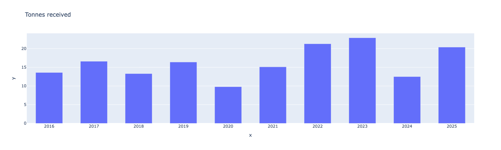
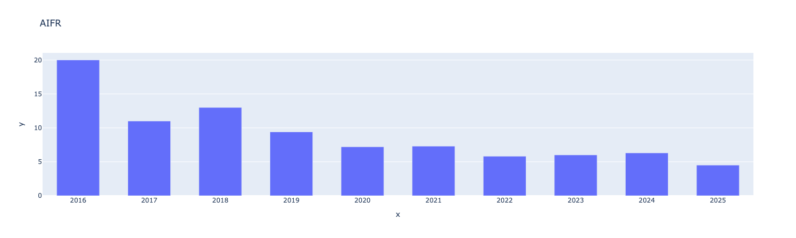
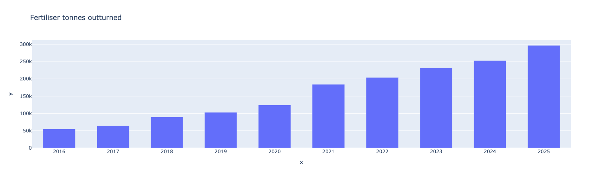
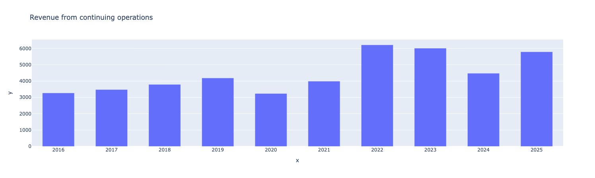
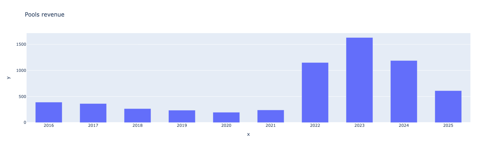
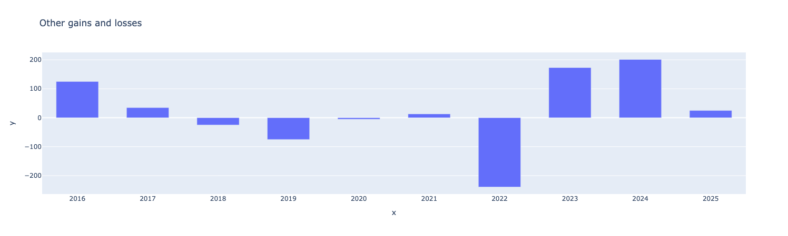
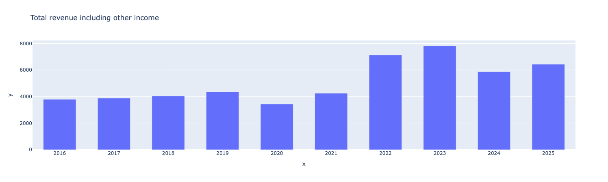

# CBH Dashboard

CBH Dashboard is a small Python project that extracts key metrics from CBH annual report PDFs, stores them in a local SQLite database, and displays the results in an interactive Dash dashboard.

The project currently parses selected annual report files from `src/files`, saves the extracted metrics to `data.db`, and renders each metric as a Plotly bar chart.

## Dashboard Preview















## Features

- Extracts text from annual report PDFs with `PyPDF2`
- Parses operational, safety, and financial metrics with regular expressions
- Stores metric names and yearly data points in SQLite
- Serves a local Dash dashboard with Plotly charts
- Includes annual report PDFs from 2012 through 2025

## Metrics

The parser currently looks for:

- Tonnes received / tonnes handled
- All-injury frequency rate (AIFR)
- Fertiliser tonnes outturned
- Revenue from continuing operations
- Pools revenue
- Other gains and losses
- Total revenue including other income

## Requirements

- Python 3.14 or newer
- Poetry

Project dependencies are managed in `pyproject.toml` and locked in `poetry.lock`.

## Installation

Install dependencies with Poetry:

```bash
poetry install
```

## Usage

Run the application:

```bash
poetry run cbh
```

Or run the module directly:

```bash
poetry run python -m cbh.main
```

When `data.db` does not contain the expected tables, the app initializes the database, extracts data from the configured PDFs, and then starts the dashboard. If the database already exists, PDF extraction is skipped and the dashboard starts immediately.

Dash runs in debug mode and will print the local dashboard URL in the terminal, usually:

```text
http://127.0.0.1:8050/
```

## Data Refresh

The app treats the existing SQLite database as the source for the dashboard. To rebuild the database from the PDFs, remove `data.db` and run the app again:

```bash
rm data.db
poetry run cbh
```

By default, `src/cbh/main.py` extracts from the 2020 and 2025 PDFs:

```python
for year in [2020, 2025]:
```

Update that list if you want to parse additional annual reports.

## Project Structure

```text
.
├── data.db              # Local SQLite database used by the dashboard
├── pyproject.toml       # Project metadata, dependencies, and CLI script
├── poetry.lock          # Locked dependency versions
├── src/
│   ├── cbh/
│   │   ├── dashboard.py # Dash and Plotly dashboard
│   │   ├── db.py        # SQLite schema and data access helpers
│   │   ├── main.py      # Application entry point
│   │   └── pdf.py       # PDF text extraction and metric parsing
│   └── files/           # Annual report PDFs
└── tests/               # Test package placeholder
```

## How It Works

1. `cbh.main` checks whether the SQLite database has been initialized.
2. If needed, `cbh.db` creates the `metrics` and `data_points` tables.
3. `cbh.pdf.PDFData` loads annual report PDFs and extracts metric values from the text.
4. `cbh.db.save_to_db` stores extracted values by metric and year.
5. `cbh.dashboard.create_dashboard` reads the database and builds one bar chart per metric.

## Notes

- PDF parsing depends on the exact text layout extracted from each annual report, so new PDF formats may require updates to the regular expressions in `src/cbh/pdf.py`.
- The current dashboard reads from the local `data.db` file in the repository root.
- There are no substantive tests yet; `tests/__init__.py` is currently only a placeholder.

## License

No license file is currently included.
